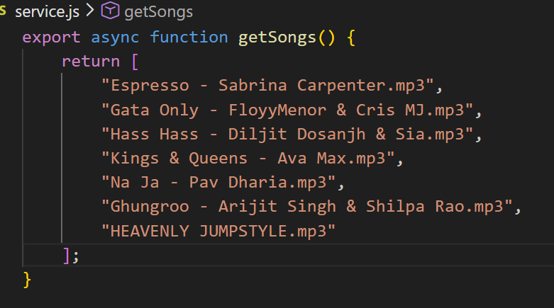

# Music Player UI

This is a music player web application built using HTML, CSS, and JavaScript.  
The project was created to practice JavaScript logic, DOM manipulation, and building interactive user interfaces inspired by modern music streaming platforms.

---

## 🛠 Tech Stack

- HTML
- CSS
- JavaScript

---

## 📚 What I Learned

- Structuring a frontend project using modular files
- Working with JavaScript modules and functions
- Handling audio playback using JavaScript
- Implementing search functionality based on user input
- Dynamically updating the UI using DOM manipulation
- Managing assets such as songs, images, and icons
- Improving UI consistency by replicating real-world application layouts

---

## ✨ Features

- Music streaming–style user interface
- Search songs by song name or artist name
- Scroll through the song list smoothly
- Play and pause audio tracks
- Next and previous song controls
- Dynamically loaded song list using JavaScript
- Easy addition of custom songs through the `songs` folder

### ➕ How to Add Songs

1. Add the `.mp3` file to the `songs` folder.
2. Open the `service.js` file.
3. Add the song name using the format:

4. The song will automatically appear in the UI and can be played.

---

## 🚧 Project Status

Completed (for learning purposes)

---

## 🚧 Limitations / Future Improvements

- The **Trending Songs** section currently contains UI cards only.
- These cards do not have playback functionality yet.
- Planned improvements include:
- Making trending songs clickable
- Connecting trending cards to the main audio player
- Enhancing overall interactivity and state handling

---

## ⚠️ Disclaimer

This project is created only for educational purposes.  
It is not affiliated with Spotify or any music streaming service.  
No login, no data collection, and no user information is stored.

---

## 🌐 Live Demo

👉 https://harsh-berwal.github.io/spotify-ui-clone/

---

## 📸 Project Preview

