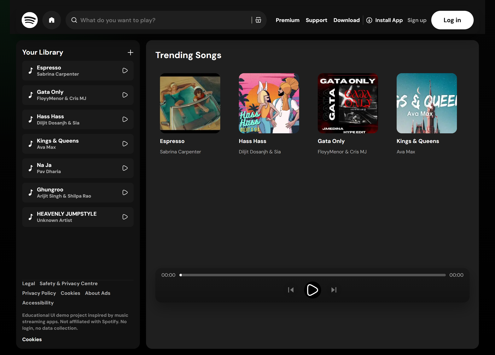
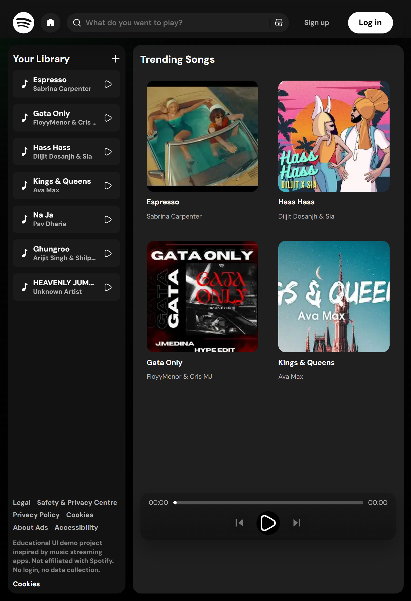
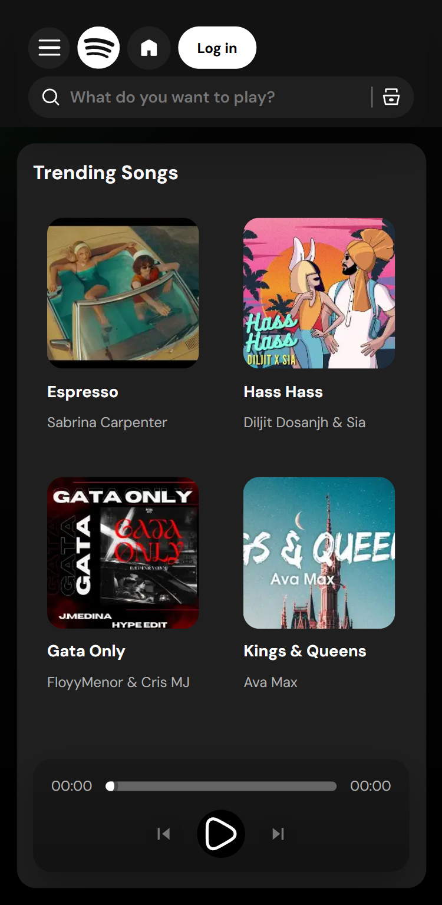
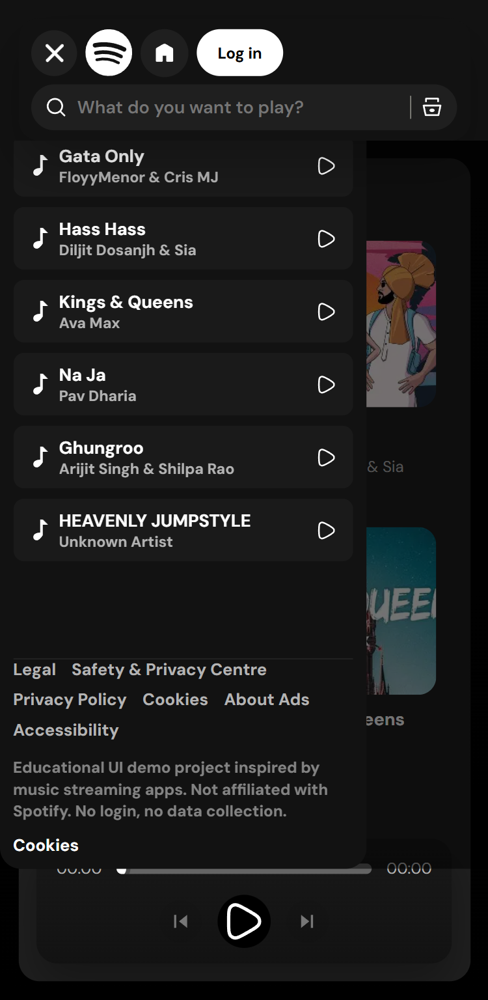
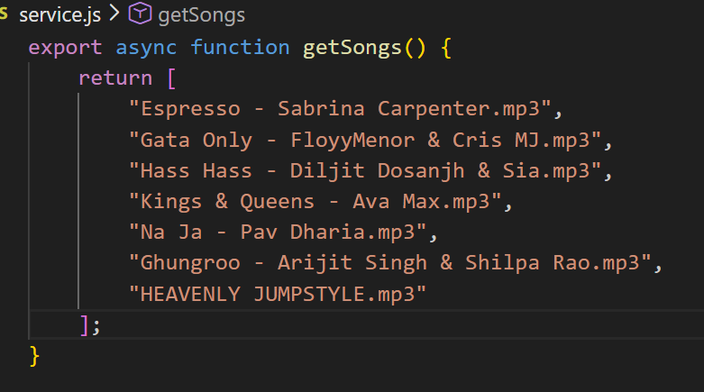

# 🎵 Spotify UI Clone

A responsive Spotify-inspired music player built using HTML, CSS, and JavaScript.

This project was created to strengthen my frontend development skills by practicing responsive layouts, DOM manipulation, JavaScript logic, audio playback controls, and building real-world user interfaces.

---

## 🌐 Live Demo

👉 https://harsh-berwal.github.io/spotify-ui-clone/

---

## 🛠 Tech Stack

- HTML5
- CSS3
- JavaScript (Vanilla JS)

---

## ✨ Features

- Responsive design for Desktop, Tablet, and Mobile devices
- Spotify-inspired user interface
- Search songs by song title or artist name
- Dynamic song loading using JavaScript
- Audio playback controls
  - Play
  - Pause
  - Next Song
  - Previous Song
- Interactive song library
- Custom scrollbar styling
- Mobile sidebar navigation
- Easy song management through the songs folder

---

## 📚 What I Learned

Through this project I practiced:

- Responsive Web Design
- CSS Flexbox and Grid
- Media Queries
- JavaScript DOM Manipulation
- Event Handling
- Audio API Integration
- Dynamic UI Updates
- Project Structure Organization
- Real-world UI Recreation

---

## 📸 Screenshots

### Desktop View

---

### Tablet View

---

### Mobile View

---

### Mobile Sidebar

---

## ➕ How to Add Songs

1. Add your `.mp3` file inside the `songs` folder.
2. Open `service.js`.
3. Add the song details using the existing format.
4. Save the file.
5. The song will automatically appear in the application.

### Example

---

## 🚧 Current Limitations

- Trending Songs cards are currently UI elements only.
- Trending songs are not yet connected to the audio player.
- No playlist creation functionality.
- No volume control.
- No repeat or shuffle functionality.

---

## 🔮 Future Improvements

- Make Trending Songs playable
- Add playlist functionality
- Add volume controls
- Add shuffle and repeat modes
- Improve animations and transitions
- Add local storage support
- Add dark/light theme support

---

## ⚠️ Disclaimer

This project was built for educational and learning purposes only.

It is not affiliated with Spotify or any music streaming platform.

No user authentication, data collection, or personal information storage is implemented.

---

## 👨‍💻 Author

**Harsh Berwal**

Frontend Developer | Computer Science Student

If you found this project interesting, feel free to star the repository ⭐